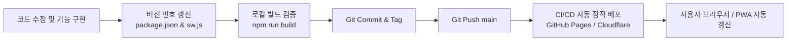

# TickTen 버전 관리 및 업데이트 배포 가이드

TickTen의 기능 추가, 버그 수정, 디자인 개선 등 **버전 업그레이드 시 안전하게 배포하고 사용자의 스마트폰에 최신 버전이 반영되도록 하는 절차**입니다.

---

## 1. 버전 업데이트 워크플로우 한눈에 보기



---

## 2. 세부 업데이트 단계

### 1단계: 버전 번호 올리기
프로젝트의 버전은 시맨틱 버저닝(Semantic Versioning: `MAJOR.MINOR.PATCH`)을 따릅니다:
- **PATCH** (예: `1.0.0` $\rightarrow$ `1.0.1`): 버그 수정, 스타일 미세 조정
- **MINOR** (예: `1.0.0` $\rightarrow$ `1.1.0`): 새로운 기능 추가 (예: 새로운 사운드 프리셋, 세트 카운트 기능 등)
- **MAJOR** (예: `1.0.0` $\rightarrow$ `2.0.0`): 대대적인 UI 개편 또는 구조 변경

#### A. `package.json` 버전 수정
```bash
# npm 명령어를 이용해 올리거나 직접 package.json의 version 필드를 수정합니다.
npm version patch # 또는 npm version minor
```

#### B. ⚠️ 중요: PWA 캐시 버전 변경 (`public/sw.js`)
스마트폰에 PWA로 설치한 사용자는 오프라인 캐시가 우선 로드되므로, 서비스 워커의 캐시 버전을 함께 올려주어야 스마트폰이 새 버전을 자동으로 다운로드합니다.

`public/sw.js` 파일 상단:
```javascript
// 변경 전
const CACHE_NAME = 'tickten-v1';

// 변경 후 (버전에 맞게 증가)
const CACHE_NAME = 'tickten-v2';
```

---

### 2단계: 로컬 빌드 및 동작 검증
배포 전 빌드 오류나 타입 에러가 없는지 확인합니다.

```bash
# 1. 타입 체크 및 빌드
npm run build

# 2. 로컬에서 프로덕션 빌드 결과물 미리보기
npm run preview
```

---

### 3단계: Git 커밋 및 태깅
수정 사항을 커밋하고 릴리즈 태그를 붙입니다.

```bash
git add .
git commit -m "feat: 10초 비프 외에 5초 프리셋 추가 및 UI 개선 (v1.1.0)"

# Git 태그 생성 (선택 사항이나 버전 관리 권장)
git tag v1.1.0
```

---

### 4단계: 원격 저장소 푸시 및 자동 배포
`main` 브랜치에 푸시하면 연동된 CI/CD 파이프라인(GitHub Actions 또는 Cloudflare Pages)이 자동으로 실행되어 수십 초 내에 배포가 완료됩니다.

```bash
git push origin main
git push origin --tags
```

---

## 3. 사용자 스마트폰(PWA)에서의 업데이트 반영 과정

1. **자동 감지**: 사용자가 인터넷이 연결된 상태에서 웹앱(또는 홈 화면에 설치된 PWA)을 실행하면, 백그라운드에서 브라우저가 새 `sw.js`와 새 정적 번들을 내려받습니다.
2. **새 버전 활성화**: `sw.js`의 `skipWaiting()`과 `clients.claim()` 로직 덕분에 백그라운드 설치 후 앱을 새로고침하거나 다음에 앱을 열 때 즉시 최신 버전으로 전환됩니다.
3. **오래된 캐시 정리**: 새 버전이 활성화되면서 이전 버전(`tickten-v1`)의 캐시 데이터는 자동으로 삭제되어 디바이스 용량을 차지하지 않습니다.

---

## 4. 배포 버전 확인 방법 (개발자용 은밀한 확인)

배포 후 일반 사용자의 UI를 해치지 않으면서 배포가 정상 반영되었는지 확인하는 3가지 경로입니다:

1. **서버 배포 즉시 확인 (`/version.json`)**:
   - 주소창에 `https://<도메인>/version.json` 입력
   - PWA 로컬 캐시와 무관하게 호스팅 서버에 최신 번들이 빌드/배포되었는지 즉시 확인 가능.
2. **스마트폰/모바일 PWA 확인 (5회 연속 탭 이스터 에그)**:
   - 앱 상단의 **'TickTen' 타이틀/로고 영역을 2초 내에 5번 연속 탭**
   - 하단에 버전과 빌드 시각이 담긴 시크릿 토스트 팝업 표시 (원터치 복사 및 닫기 가능).
3. **PC 브라우저 확인 (F12 콘솔)**:
   - F12 개발자 도구 콘솔에 배지 형태로 버전 정보 출력
   - 또는 콘솔 창에서 `window.__TICKTEN_VERSION__` 입력하여 상세 정보 조회.

